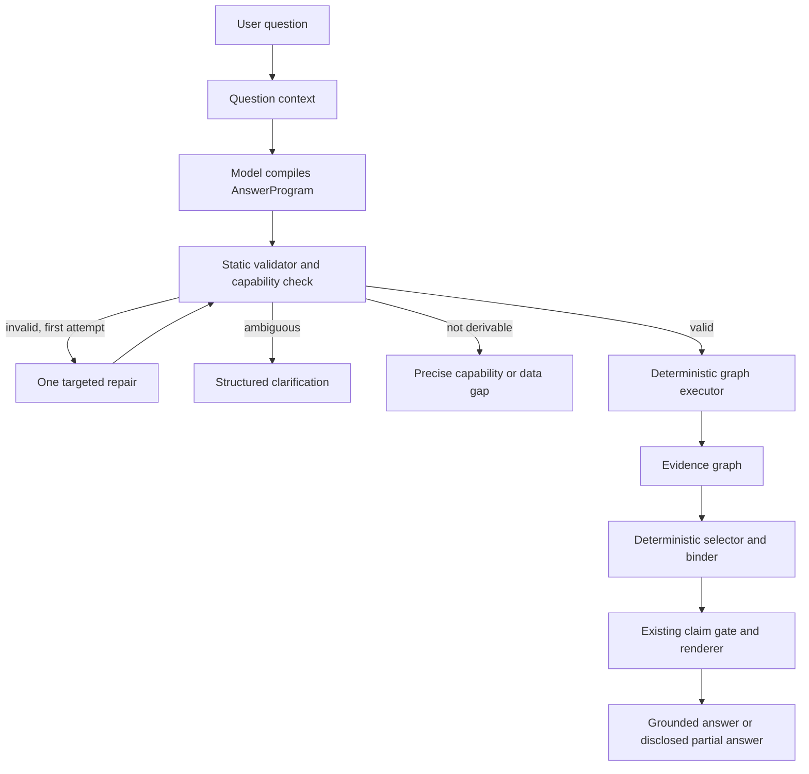

# The Answer Program and Financial Query Engine

> **Historical built-design record.** The validator, executor, query engine,
> evidence, binder, and renderer described here remain current. Direct runtime
> model authorship of the executable AnswerProgram was tried and is superseded
> by [semantic requests and deterministic lowering](semantic-request-and-deterministic-lowering.md)
> under [ADR-014](decisions/ADR-014-financial-meaning-before-executable-programs.md).

**State:** historical; retained runtime built, direct compiler superseded
**Rules:** AP-1, AP-2, AP-3, AP-4, AP-5, AP-6, AP-7, AP-8

**Audience:** product, backend, model orchestration, desktop, quality, and release teams

**Decision owner:** product owner

**Implementation status:** This records the design that was built and tested.
Its direct-program compiler did not pass the fresh Witness and is no longer a
runtime entry. The retained lower runtime is used by the current design.

## Rules

### AP-1 — The complete answer contract precedes current-turn data
**State:** enforced
**Code:** product/viva/answer_program/compiler.py, product/viva/session.py
**Test:** product/tests/test_answer_program_contracts.py::test_compiler_repairs_a_malformed_semantic_request_before_any_read

1. The semantic compiler receives data-blind question context, but no current financial result.
2. Deterministic lowering authors shape, graph, selectors, and result policy; the whole result is validated before the first read.

### AP-2 — Compilation uses one attempt and at most one pre-read repair
**State:** enforced
**Code:** product/viva/answer_program/compiler.py
**Test:** product/tests/test_answer_program_contracts.py::test_compiler_repairs_a_malformed_semantic_request_before_any_read

1. A valid semantic request costs one model call; one repairable compact-contract defect may cost one more.
2. Execution never begins between those attempts.

### AP-3 — The executable wire contract is frozen and digested
**State:** enforced
**Code:** product/viva/answer_program/schema.py, product/viva/schemas/answer-program-schema-v1.json, product/viva/versions.json
**Test:** product/tests/test_answer_program_contracts.py::test_packaged_program_schema_is_the_complete_executable_contract

1. The schema supplied to the provider is loaded from the immutable packaged artifact.
2. Admission and release profiles carry that artifact's digest.

### AP-4 — Financial queries preserve trusted quantity, currency, boundary, and provenance
**State:** enforced
**Code:** product/viva/query/execute.py, product/viva/query/sources.py, product/viva/answer_program/validate.py
**Test:** product/tests/test_financial_query.py::test_joined_money_arithmetic_refuses_cross_currency_rows

1. A model cannot relabel a quantity, mint a whole boundary, use a row key as evidence, or combine unlike currencies.
2. Emitted financial figures inherit these declarations from registered sources and typed operators.

### AP-5 — Admitted work is finite and bounded before and during execution
**State:** enforced
**Code:** product/viva/answer_program/validate.py, product/viva/answer_program/execute.py
**Test:** product/tests/test_answer_program_contracts.py::test_execution_deadline_bounds_a_running_local_read

1. Static limits cover graph size, depth, figures, evidence, and declared work.
2. A running local read cannot extend the turn past the execution deadline.

### AP-6 — Required clauses and partial-answer policy are executable gates
**State:** enforced
**Code:** product/viva/answer_program/bind.py, product/viva/tools/runner_delivery.py
**Test:** product/tests/test_answer_program_contracts.py::test_result_policy_is_enforced_after_clause_binding

1. Every required clause must survive binding.
2. A missing independent clause is disclosed only when the committed policy permits a partial answer.

### AP-7 — Admission measures and enforces one exact runtime profile
**State:** enforced-with-exception
**Code:** product/viva/answer_program/admission.py, product/viva/answer_program/release.py, product/viva/speak.py
**Test:** product/tests/test_answer_program_contracts.py::test_release_gate_rejects_a_profile_fabricated_from_passing_scores

1. The keyed and adversarial suites measure one provider route, requested model, provider-resolved model, modality, locale family, prompt, schema, and capability manifest.
2. Runtime refuses a different build or model identity before reading the vault.

**Exception:** no profile is published yet. Threshold approval and the explicitly deferred local real-vault Witness remain release gates.

### AP-8 — Production has one AnswerProgram path
**State:** enforced
**Code:** product/viva/answer_program/release.py
**Test:** product/tests/test_answer_program_contracts.py::test_single_path_gate_scans_non_python_runtime_sources

1. The procedural planner and its loop protocol are absent from production code.
2. Deterministically lowered semantic families enter the same validator, executor, evidence graph, binder, and renderer. Open-ended model-authored programs are not a runtime path.

## 1. Purpose

This document is the complete delivery brief for rebuilding Viva's natural-language
answer path so that an answerable question does not fail because an iterative model
loop exhausted an arbitrary transcript counter.

It defines:

- the product promise and its honest boundary;
- the decisions the implementation must preserve;
- the target runtime architecture;
- the `AnswerProgram` and financial-query contracts;
- validation, execution, binding, rendering, and failure semantics;
- separate resource budgets;
- model admission and evaluation;
- the dependency-ordered delivery phases;
- phase deliverables, tests, exit gates, release, and removal of the superseded path;
- ownership boundaries and the final definition of done.

A delivery team should be able to implement the path from this document without
having to reconstruct the design argument from conversations or archived work.
When this brief conflicts with current code, current code remains the description
of what ships until a phase explicitly replaces it. The trust invariants named
below are not open to reinterpretation by an implementation team.

## 2. Executive decision

### Implementation status

Phases 0 through 6 are implemented in the product path. The candidate runtime has
one data-blind compiler call (plus at most one structural repair), whole-program
validation, bounded execution, one evidence graph and binder, the finite FQIR
operator/source registry, ten reviewed known intents, structured clarification and
assumption outcomes, replay capture, and local breadth diagnostics. The former
procedural planner is absent from production code.

Phase 7's admission and release machinery is implemented: exact model profiles,
absolute safety gates, frozen and adversarial corpora, replay, prompt/manifest
matching, and the single-path packaging check. An admission profile is deliberately
not checked into the repository merely because the machinery exists. Publishing
one remains blocked until a configured real model passes the controlled synthetic
suite and the local real-vault Witness accepts the result. Those are measured
release events, not assertions code can substitute for.

All controlled synthetic results recorded before the current corpus, reviewed
intent, persona, resource-policy, AnswerProgram-schema and Financial-Query-schema
digests were bound into the report are historical diagnostics, not admission
evidence for this build. The most recent such run passed the adversarial suite and
nine of ten keyed cases with its then-current absolute counters at zero, but it is
now superseded as well as below threshold. The current build is unmeasured and no
profile is published. A fresh controlled run, explicit threshold approval, and the
deferred local real-vault Witness remain release gates.

Viva will stop using an open-ended model-driven tool loop as the primary answer
architecture. The model will instead act as a **semantic compiler**.

Before it sees any financial result from the current turn, the model will produce
one versioned, typed and bounded `AnswerProgram` containing:

1. the shape of the answer;
2. the financial meaning of every requested claim;
3. the complete graph of reads and computations needed to establish those claims;
4. deterministic rules for selecting results and filling holes;
5. which claims are required and which are optional;
6. any clarification or user-supplied assumption on which the program depends.

Deterministic code will validate the whole program before any read, execute its
local operations, build an evidence graph, bind compatible evidence to the
committed shape, and pass the result through the existing delivery and rendering
gate.

The usual path will spend one model call. A structurally invalid program may
receive one correction before any read, for a maximum of two compile attempts.
No model sees current-turn financial results and then writes or revises the
answer's prose. No model performs arithmetic, grades evidence, certifies
completeness, or writes a financial value.

The complete product path is:



## 3. Product promise

The implementation must be built toward this promise:

> If a well-defined question has an answer derivable from the information in the
> vault using Viva's admitted financial operations, Viva returns a grounded answer.
> If the meaning is ambiguous, an assumption is required, data is missing, or an
> operation is not yet supported, Viva identifies that condition precisely. An
> answerable question never fails merely because an arbitrary tool counter expired.

The product must not promise to answer every imaginable financial question.
Complete stored data is necessary but not sufficient. A question is answerable
only when:

```text
relevant facts exist
AND the user's meaning is resolved
AND the derivation is expressible
AND every operation is admitted and bounded
AND the result can pass the evidence and rendering gates
```

The response vocabulary is therefore not only `answered` or `refused`. It is:

- `answered` — every stated claim is grounded;
- `partial` — at least one independent claim is grounded and every omitted claim
  is disclosed;
- `needs_clarification` — more than one materially different interpretation is
  possible;
- `needs_assumption` — the question is answerable only under a value or policy the
  person has not supplied;
- `missing_data` — the derivation exists but the required evidence is absent;
- `capability_gap` — the data exists or may exist, but no admitted operation can
  derive the requested claim;
- `outside_domain` — the request is not a read about this person's financial vault;
- `failed` — infrastructure or model transport failed before a trustworthy result
  could be produced.

None of the last six statuses may be presented as a grounded financial answer.

## 4. Current system and the defect being replaced

The existing answer path is valuable but procedurally fragile:

1. The model commits a shape.
2. Tools become available.
3. The model chooses one or more calls.
4. Results are returned to the model.
5. The model chooses another step or delivers bindings.

The default limit is eight transcript entries. That number is not a clean model
budget or a clean tool budget. It includes the committed shape and tool results,
while malformed-response correction calls are not counted. A normal run therefore
has one shape entry and at most seven local reads; re-shaping and deterministic
refusals reduce that number. Native parallel calls may share a model round-trip,
while sequential calls do not. An already-issued parallel batch can be cut off
after an arbitrary prefix when the transcript reaches the ceiling.

The resulting defects are:

- correctness competes with a mixed accounting counter;
- cheap local reads are treated as the scarce resource instead of model calls;
- the complete cost and feasibility of a plan are unknowable before execution;
- recovery consumes capacity needed for evidence;
- queued work can be discarded according to incidental call order;
- a model can commit a hole no registered capability can ever fill;
- provider-specific tool-calling reliability controls product reliability;
- current acceptance tests prove routes using a provider double, not real model
  compilation quality;
- the answer path has no keyed end-to-end evaluation capable of measuring whether
  a real model chose the complete and correct derivation.

Increasing the constant is not the design. This brief replaces the loop and removes
the mixed counter; it does not spend delivery work preserving or tuning them.

## 5. Non-negotiable invariants

The following requirements survive every phase.

### 5.1 Verification stays outside model weights

- Models may interpret language and propose structure.
- Models never perform authoritative arithmetic, reconciliation, evidence grading,
  coverage certification, or provenance checks.
- No model checks another model's work as the authority.
- Every financial operation used in an answer is deterministic, inspectable code.

### 5.2 Shape and selection policy precede current-turn data

- The answer's literal words and typed holes are committed before any financial
  result from the current turn is read.
- The rules that decide which result may fill a hole are also committed before the
  data is read.
- A post-execution model call may not add, reword, rank, or reinterpret claims.
- Static correction is allowed only while no program node has executed.
- A later program may weaken by dropping claims; it may not tailor new claims to
  values already observed.

Prior conversational text may resolve references such as “that account” or “the
same month,” as it does today. Prior figures remain context, never current evidence,
and must be re-established in the new turn.

### 5.3 Models write no financial values

- Literal answer text carries no digits.
- Amounts, dates, counts, rates, names, grades, scope statements, caveats, and
  coverage are rendered from typed evidence.
- User-supplied numeric assumptions are preserved as stipulations and are never
  upgraded to measurements.

### 5.4 One grounding and rendering path

- The new executor feeds the existing evidence, binding, and delivery laws.
- Fast-path intents, general programs, partial answers, and hypothetical scenarios
  do not receive separate, weaker gates.
- Every stated money figure has records behind it or the statement is refused.
- Quantity, scope, subject, date, period, currency, caveat, and grade rules apply
  uniformly.

### 5.5 Read-only and local by construction

- An answer program may call only capabilities registered as local and read-only.
- It cannot write ledger events other than the existing capture of what the answer
  process did.
- It cannot send data to a network service other than the configured model compile
  request already authorized by the person.
- Proposals and confirmed writes remain a different path.

### 5.6 Bounded before execution

- The complete required program is statically countable before the first read.
- Cycles, unbounded traversal, arbitrary code, raw SQL, and runtime-created nodes
  are forbidden.
- Required work is admitted as a whole or rejected before execution.
- Optional work may be omitted under resource policy, and that omission is
  explicit in the result.

## 6. Target components

### 6.1 `QuestionContext`

`QuestionContext` is the only input to program compilation. It contains:

- the exact current question;
- prior visible questions and answers as conversational text;
- today's date;
- locale and currency-writing conventions by identifier, not private examples;
- the capability manifest version;
- the answer-program schema version;
- the shape vocabulary version;
- the configured resource policy;
- no current-turn tool result and no hidden ledger value.

The context must be serializable and captured verbatim with the compile exchange.
The compiler prompt must be a versioned file. A released prompt is never edited.

### 6.2 `CapabilityManifest`

The capability manifest is generated from executable registrations, not maintained
as competing prose. It tells the compiler and validator what can actually be
established.

Each capability declares:

```json
{
  "name": "query_ledger",
  "version": "tools-v22",
  "local_only": true,
  "read_only": true,
  "input_schema": {},
  "emits": {
    "figure_kinds": ["money", "count"],
    "quantities": ["balance", "owed", "spending"],
    "entity_kinds": ["account", "merchant", "category"],
    "supports_rows": true,
    "supports_periods": true
  },
  "bounds": {
    "max_figures": "named constant",
    "max_payload_bytes": "named constant"
  }
}
```

The manifest must allow the validator to prove whether each hole has at least one
possible producer. A type taught to the model but emitted by no capability fails a
build-time consistency test.

The manifest has a digest. Its version and digest travel with every compiled
program so a recorded plan can be interpreted later.

### 6.3 `AnswerProgramCompiler`

The compiler wraps one admitted model and one modality. It does not execute tools.

Its responsibilities are:

- interpret the user's question;
- identify independent requested claims;
- distinguish facts, comparisons, scenarios, recommendations, and ambiguities;
- commit an answer shape;
- build the required and optional node graph;
- declare binding selectors;
- declare clarification or assumption requirements;
- return exactly one `AnswerProgram` object.

The compiler gets one normal attempt. If static validation returns a repairable
problem, it gets one targeted correction containing:

- the machine-readable defect tag;
- the invalid path in the program;
- the accepted schema fragment or capability alternatives;
- one requested change.

The correction contains no financial data because execution has not begun. A
second invalid reply ends as `failed:invalid_program`.

Native structured output may be used where admitted. A fenced or plain JSON
protocol is the transport-neutral fallback. Provider-native tool calling is not
required for this architecture.

### 6.4 `AnswerProgram.v1`

The first public contract is an immutable, versioned JSON object:

```json
{
  "program_version": "answer-program-schema-v1",
  "mode": "answer",
  "question_kind": "compound_financial_read",
  "shape": {
    "clauses": [
      {
        "id": "liquidity_clause",
        "text": "Your supported liquidity is {liquidity}.",
        "slots": [
          {
            "name": "liquidity",
            "type": "money",
            "quantity": "balance",
            "scope": ["whole"]
          }
        ]
      }
    ]
  },
  "nodes": [
    {
      "id": "balances",
      "kind": "tool_read",
      "tool": "query_ledger",
      "args": {"entity": "balances"},
      "depends_on": [],
      "importance": "required"
    },
    {
      "id": "gaps",
      "kind": "tool_read",
      "tool": "check_completeness",
      "args": {},
      "depends_on": [],
      "importance": "supporting"
    }
  ],
  "bindings": [
    {
      "hole": "liquidity",
      "source": "balances",
      "reference_kind": "figure",
      "selector": {
        "quantity": "balance",
        "scope": ["whole"],
        "cardinality": "one"
      }
    }
  ],
  "assumptions": [],
  "clarification": null,
  "result_policy": {
    "allow_partial": true,
    "required_clauses": ["liquidity_clause"]
  }
}
```

#### Required top-level fields

- `program_version` — exact schema identifier;
- `mode` — `answer`, `clarify`, `needs_assumption`, or `outside_domain`;
- `question_kind` — diagnostic taxonomy, never an execution switch by itself;
- `shape` — the existing typed-hole grammar for answer modes;
- `nodes` — a finite ordered set whose dependency edges form a DAG;
- `bindings` — pre-data selectors that connect holes to node outputs;
- `assumptions` — references to values supplied by the person, never invented
  defaults;
- `clarification` — structured ambiguity only in clarification mode;
- `result_policy` — required claims and whether independent optional claims may
  survive.

#### Node kinds in the first release

- `tool_read` — one call through the existing registry;
- `resolve_entity` — deterministic resolution of an account, merchant, category,
  tag, document kind, or other admitted entity from words in the question;
- `compute` — exact arithmetic over symbolic outputs of earlier nodes using the
  current compute grammar;
- `financial_query` — a typed financial query IR introduced in the breadth
  release;
- `conditional` — a bounded branch declared before execution over a closed
  machine predicate such as `resolved_unique`, `result_nonempty`, or
  `coverage_complete`.

No node may contain arbitrary source code, SQL, JSONPath, prompt text, or a tool
name that is not in the manifest.

#### Symbolic references

A later node may refer to an earlier result without knowing its runtime id:

```json
{
  "ref": {
    "node": "merchant_resolution",
    "value": "unique_entity_key"
  }
}
```

The set of legal `value` names is declared by the producing capability. General
path traversal is forbidden. The validator type-checks the reference and requires
the producer to be in `depends_on`.

#### Selectors

A binding selector describes the result intended before values are visible. The
first release supports:

- exact quantity and scope;
- exact entity kind and a symbolic resolved entity;
- exact currency when the user named one;
- newest or oldest by evidence date;
- largest or smallest by absolute magnitude;
- deterministic top or bottom `N`, where `N` came from the question or a bounded
  program literal;
- all rows from one reading;
- date or period belonging to a selected figure;
- one exact figure where the constraints leave one candidate.

Ties use stable ids unless the question requires clarification. A selector cannot
choose on a property the user did not request if that choice would change the
meaning of the answer.

### 6.5 `ProgramValidator`

Validation is pure and performs no read. It returns all detectable defects in one
pass where doing so does not obscure a root cause.

Validation stages, in order:

1. JSON and schema validity;
2. supported program version;
3. valid mode and mode-specific required fields;
4. existing shape grammar validity;
5. unique node, clause, and hole ids;
6. known capability and valid arguments;
7. dependency existence, ordering, and acyclicity;
8. symbolic reference type compatibility;
9. capability reachability for every hole;
10. selector compatibility with the hole's type, quantity, and scope;
11. assumption provenance in the current question;
12. required-versus-optional claim consistency;
13. read-only and local-only policy;
14. static resource cost;
15. renderability through the single answer gate.

The validator produces a normalized program. Normalization may sort sets, remove
empty optional fields, and canonicalize equivalent declarations. It may not add a
claim, node, filter, assumption, or selector.

### 6.6 `ProgramExecutor`

The executor receives only a validated normalized program.

It must:

- create a fresh per-turn evidence graph;
- topologically schedule nodes;
- execute independent nodes concurrently where the projection is safe to read
  concurrently;
- admit a required execution wave atomically;
- memoize byte-equivalent calls within the turn;
- resolve only typed symbolic references;
- pass every tool call through the existing registry validator;
- stamp successful results into the evidence graph;
- preserve refused results for diagnosis without treating them as evidence;
- stop nodes whose dependencies failed;
- run supporting and optional nodes only under their resource policy;
- produce a complete execution trace;
- never call the model.

The executor does not invent a recovery call. Recovery is one of:

- a predeclared conditional branch;
- an independent clause being dropped;
- a precise data or capability gap;
- a new user turn after clarification.

This rule prevents an execution failure from reopening the answer shape after data
has been observed.

### 6.7 `EvidenceGraph`

The current runner's `_Ground` concept becomes an explicit internal contract. It
stores:

- figures;
- entities;
- readings;
- dates attached to figures;
- attested periods;
- caveats;
- record ids and provenance;
- evidence grades;
- quantity, boundary, and direction declarations;
- node and result lineage;
- user stipulations separately from measurements.

Every derived value points to its operand nodes and figures. No refused result
contributes identities or evidence. Id spaces restart per turn. A reference from a
prior turn is invalid until re-established.

The evidence graph is internal and serializable for evaluation and diagnostics.
The model does not receive it on the normal path.

### 6.8 `DeterministicBinder`

The binder evaluates committed selectors against the evidence graph.

For each hole it must:

1. find outputs from the declared source node only;
2. filter by reference kind;
3. apply quantity, scope, subject, currency, date, period, and direction rules;
4. apply the declared stable selector;
5. require the declared cardinality;
6. emit the existing reference form, such as `figure`, `entity`, `read`,
   `date_of`, or `period`;
7. record why no binding was possible.

The binder never chooses a semantically convenient alternative. A selector that
does not resolve uniquely produces a clause gap or clarification according to the
program's policy.

### 6.9 Delivery and rendering

Delivery reuses the current binding and rendering authorities. Refactoring them
into public internal interfaces is allowed; duplicating them is not.

Delivery must continue to guarantee:

- every stated figure came from this turn;
- every financial figure is cited;
- every hole and binding type agrees;
- quantity and scope agree both ways;
- subjects belong to the figures stated beside them;
- dates and periods belong to figures in their clauses;
- mixed currencies are not combined;
- caveats, boundaries, account coverage, and weakest grade are placed by code;
- a missing hole drops its clause and is disclosed;
- an answer with no surviving claim returns a non-answer status;
- no finished financial sentence is accepted from a model.

### 6.10 Structured non-answer outcomes

Non-answer outcomes are data contracts, not improvised prose.

#### Clarification

```json
{
  "status": "needs_clarification",
  "tag": "ambiguous_house_spending_scope",
  "question": "Which costs should ‘the house’ include?",
  "options": [
    {"id": "property_costs", "label": "Mortgage and property costs"},
    {"id": "household_purchases", "label": "Repairs and household purchases"},
    {"id": "all", "label": "Everything associated with the property"}
  ]
}
```

Options contain no model-invented financial facts. A person's choice becomes
current-question context in the next turn.

#### Missing assumption

The result names the policy or value required, such as forecast horizon, risk
tolerance, target reserve, or whether a category should count as discretionary.
No default is silently selected.

#### Missing data

The result names the data class and period needed, never a fabricated value. Where
a document type is known, it may name the document that would close the gap.

#### Capability gap

The result names the requested operation in product language and records the
machine capability id internally. It must be distinguishable from missing data so
the product backlog can count genuine breadth gaps.

## 7. Financial Query IR

`AnswerProgram.v1` first composes the existing tools. Broad, complicated question
coverage requires a typed Financial Query Intermediate Representation, abbreviated
`FQIR`. This is the breadth layer and must not be confused with unrestricted code.

### 7.1 Purpose

FQIR lets one model-compiled program express a derivation such as:

> Select supported spending movements in each complete month, group them by
> category, join each month to supported attributed income, compute the category's
> share of income, compare the six months before and after the person's move, and
> rank the changes.

The model declares the derivation. Deterministic operators execute it and propagate
evidence.

### 7.2 Admitted sources

The initial source registry should expose typed views over:

- accounts and account identity;
- dated balances and amounts owed;
- movements and derived economic nature;
- categories, tags, merchants, and entity rulings;
- statement coverage and completeness;
- holdings and positions;
- income attribution and unexplained inflows;
- transfer and settlement links;
- recurring rhythms and obligations;
- net-worth points;
- source documents and provenance;
- agent activity and model-call records.

Each source defines its row type, stable key, available dates, evidence fields,
and maximum cardinality.

### 7.3 Core types

- `Money(currency)`;
- `Decimal`;
- `Count(of)`;
- `Rate(of)`;
- `Date`;
- `Period`;
- `EntityRef(kind)`;
- `RecordRef`;
- `EvidenceGrade`;
- `Boundary`;
- `Boolean`;
- closed enumerations owned by the product.

Floats are forbidden. A money operation retains a currency type. Addition or
comparison across currencies refuses unless a future, explicitly admitted exchange
rate source and policy exists.

### 7.4 Operators

The FQIR breadth phase must implement these finite operators:

- `scan(source)`;
- `filter(predicate)` over a closed predicate vocabulary;
- `select(fields)`;
- `resolve(entity_kind, phrase)`;
- `group(keys)`;
- `aggregate(sum | count | min | max | average)` with typed output;
- `sort(keys, direction)`;
- `limit(count)`;
- `rank(keys)`;
- `calendar_window(from, to | preset)`;
- `rolling_window(width, unit)` with a declared edge policy;
- `join(left, right, typed_keys, join_kind)`;
- `union_compatible`;
- `difference` and `intersection` over compatible sets;
- `delta` and `percentage_change`;
- `ratio` over compatible quantities;
- exact `compute` using the existing expression grammar;
- `require_coverage(policy)`;
- `require_grade(minimum)`;
- `top` and `bottom` with stable tie behavior.

Predicates and joins are schema, not text expressions. No `eval`, Python, shell,
JavaScript, raw SQL, regex over private values, or user-defined function crosses
the boundary.

### 7.5 Domain operators

Generic operators must not reimplement financial meaning. Named domain operators
own definitions that are easy to get subtly wrong:

- `spending`;
- `attributed_income`;
- `unexplained_inflows`;
- `surplus`;
- `net_worth`;
- `held_balance`;
- `amount_owed`;
- `debt_service` when built;
- `recurring_spending`;
- `statement_completeness`;
- `evidence_staleness`;
- `transfer_excluded_flow`;
- `realized_change` and `unrealized_change` where supported.

These operators should call existing projection authorities rather than reproduce
their laws inside the query engine.

### 7.6 Evidence propagation

Every FQIR operator defines an evidence rule alongside its value rule.

- Filtering retains the evidence of retained rows.
- Grouping and aggregation union supporting records under existing caps.
- The output grade is the weakest grade among contributing financial facts unless
  a domain-specific authority declares a stricter rule.
- Coverage is the intersection or domain-defined composition of operand coverage,
  never the requested window merely because it was requested.
- A derived boundary is inherited only where operand boundaries agree or a named
  domain operator defines their composition.
- A hypothetical operand makes every dependent result hypothetical.
- A missing input is not zero.
- An empty aggregate can state zero only where complete evidence proves an empty
  population for the requested set.

An operator without an evidence rule cannot be registered.

### 7.7 FQIR governance

Every new source or operator requires:

- a typed schema;
- deterministic implementation;
- value semantics;
- evidence, boundary, grade, and coverage semantics;
- resource bounds;
- refusal behavior;
- property tests;
- at least one keyed end-to-end question;
- inclusion in the generated capability manifest.

This is how breadth grows. The model never invents a missing operator at runtime.

## 8. Resource policy

The single `max_calls` value is replaced by `AnswerResourcePolicy`:

```json
{
  "max_model_attempts": 2,
  "max_required_nodes": "configured named limit",
  "max_supporting_nodes": "configured named limit",
  "max_dependency_depth": "configured named limit",
  "max_evidence_bytes": "configured named limit",
  "max_execution_ms": "configured named limit",
  "max_figures": "configured named limit"
}
```

The implementation rules are:

1. Model attempts protect cost, latency, and outbound exposure.
2. Node limits protect against pathological compiled programs.
3. Dependency depth protects against sequential latency and hidden loops.
4. Evidence size protects memory and model-independent payload growth.
5. Execution time protects the application from pathological local projections.
6. Existing per-tool row, group, and journal caps remain in force.
7. Required nodes are admitted together before execution.
8. Supporting nodes execute after required nodes and may be omitted explicitly.
9. A parallel wave is admitted atomically; no arbitrary prefix executes.
10. The delivery gate has its own reserved work and is never crowded out by reads.

Phase 0 measures current real and synthetic turns and sets the named defaults. The
values are configuration data with tests, not scattered literals. Safety ceilings
may be lowered only if every required acceptance program still admits. They may be
raised only after payload and latency tests.

## 9. Deterministic intent programs

The general compiler is not required to rediscover plans the product already knows.
A `KnownIntentRegistry` provides reviewed programs for high-value question families.

The first entries are the existing acceptance families:

- current net worth;
- account inventory;
- latest-complete-month spending and breakdown;
- largest movements in a resolved month;
- supported monthly income;
- monthly surplus or shortfall;
- stalest balance;
- weakest evidence;
- recurring spending;
- concise financial-health summary.

The compiler may return an intent id and typed parameters. Code then instantiates
the reviewed program and shape. The instantiated program still passes the same
validator, executor, binder, and renderer.

An intent is promoted only when:

- its meaning is stable and domain-owned;
- its plan can be reviewed without user-specific values;
- it is frequent or promise-critical;
- its parameters preserve the user's requested scope;
- its full answer has keyed evaluation cases.

The registry must not grow into one intent per phrasing. Natural-language variety
belongs in compilation; financial meaning belongs in the intent.

## 10. Model admission

An answer compiler model is admitted for one exact combination of:

- provider and resolved model id;
- model version or pinned identifier;
- modality;
- compiler prompt version;
- `AnswerProgram` schema version;
- capability manifest version;
- locale family where relevant.

Admission measures:

- first-attempt program validity;
- validity within one correction;
- complete required-node recall;
- unnecessary-node rate;
- correct intent selection;
- clarification precision;
- assumption detection;
- selector correctness;
- follow-up reference resolution;
- answerable-question completion rate;
- unsupported-figure and confidently-wrong rates;
- median and tail model calls, tokens, cost, and latency.

Hard admission failures are:

- any unsupported financial figure reaches delivery;
- any keyed quantity, scope, subject, currency, or period is wrong;
- a missing-data case is represented as zero;
- a hypothetical result is represented as measured;
- the model requires more than one static repair on the frozen suite;
- the model emits private values outside the authorized compile request;
- the model cannot reliably produce a structured program under either admitted
  modality.

Native and text modalities are admitted separately. Runtime may automatically use
the modality that passed. It may not experiment with a person's live question to
discover compatibility.

## 11. Recording, diagnostics, and product metrics

Every turn records enough structure to replay and diagnose it:

- question and prior-context digest;
- compiler request and raw response;
- resolved model and modality;
- prompt, schema, manifest, and persona versions and digests;
- raw and normalized program;
- validation defects and repair;
- static cost estimate;
- node schedule and per-node timing;
- executed, memoized, skipped, refused, and dependency-blocked nodes;
- evidence-graph summary and size;
- selectors and final bindings;
- dropped clauses and reasons;
- final structured outcome;
- model attempts, tokens, latency, and cost;
- local execution time and payload size.

The existing raw-capture doctrine applies. Program metadata may ride in the existing
speak capture payload until an event-contract review demonstrates that a new event
type is necessary.

Operational metrics are:

- answer outcomes by status;
- answerable completion rate on keyed cases;
- model attempts per turn;
- program validation failure rate by defect;
- capability-gap frequency by requested operation;
- missing-data frequency by data class;
- clarification rate and whether the next turn resolves it;
- required and optional node counts;
- memoization savings;
- execution and delivery latency;
- holes unfilled and clauses dropped;
- unused grounded figures;
- unsupported-figure rate;
- confidently-wrong rate where a key exists;
- resource rejection rate by limit.

No metric may send personal data or telemetry by default. Real-vault metrics remain
local and are visible through the existing trust surfaces or manual diagnostics.

## 12. Failure semantics

| Condition | Outcome | Model retry | Financial result shown |
|---|---|---:|---|
| Model transport unavailable | `failed:model_unreachable` | no automatic provider change | none |
| Program is malformed or statically invalid | targeted repair once, then `failed:invalid_program` | one | none |
| Required program exceeds policy | `capability_gap:program_too_large` or focused clarification | none | none |
| Genuine language ambiguity | `needs_clarification` | none | none |
| Required user policy is absent | `needs_assumption` | none | none |
| Required evidence is absent | `missing_data` or disclosed partial | none | only independent grounded claims |
| No admitted operation can derive a claim | `capability_gap` | none | only independent grounded claims |
| A required node refuses | disclosed partial or precise non-answer | none | only independent grounded claims |
| Supporting node exceeds policy | `partial` with supporting omission | none | required grounded claims |
| Selector resolves to no compatible evidence | clause gap | none | other independent grounded claims |
| Selector is ambiguous without a declared rule | clarification or clause gap | none | no arbitrary choice |
| Delivery gate rejects every clause | precise non-answer | none | none |
| Local executor exceeds its deadline | `failed:execution_deadline` or partial if required claims already completed atomically | none | never half of one required claim |

Reviewed persona text renders machine tags. A failure message never carries a figure
or becomes evidence.

## 13. Proposed module layout

The exact names may change during code review, but ownership boundaries must remain:

```text
product/viva/answer_program/
    __init__.py          public internal contracts
    context.py           QuestionContext
    schema.py            AnswerProgram dataclasses and codecs
    capability.py        generated CapabilityManifest
    compiler.py          model call and one static repair
    validate.py          pure ProgramValidator
    normalize.py         semantics-preserving normalization
    execute.py           DAG scheduling and resource policy
    evidence.py          EvidenceGraph
    resolve.py           typed entity and symbolic resolution
    bind.py              deterministic selectors to existing references
    outcomes.py          structured answer/non-answer results
    trace.py             replayable execution trace
    intents.py           KnownIntentRegistry

product/viva/query/
    schema.py            FQIR codecs and type system
    sources.py           admitted source registry
    operators.py         generic deterministic operators
    domain.py            domain-owned financial operators
    evidence.py          propagation laws
    execute.py           bounded FQIR executor

product/viva/prompts/
    answer-program-v1.txt
    answer-program-v2.txt
    answer-program-v3.txt
    answer-program-retry-v1.txt

product/viva/evals/
    answer-program-cases-v1.json
```

Existing modules remain authorities while the replacement is implemented:

- `tools/registry.py` validates tool calls;
- `tools/envelope.py` owns result envelopes;
- `tools/runner_binding.py` and `tools/runner_delivery.py` own the claim gate;
- `tools/shape.py` owns shape grammar;
- `quantity.py` owns quantity vocabulary;
- projection modules own financial meaning;
- `session.py` owns conversation context and capture.

Refactors should expose these authorities cleanly. They must not fork them.

## 14. Delivery sequence

This is a clean replacement in an infant product. The implementation does not need
to preserve runtime compatibility with the iterative planner, support two answer
paths, migrate stored answer state, or provide a feature-flag rollback. Work may be
developed on one branch in phases, but the released code contains only the new
runtime path.

The work has eight dependency-ordered phases:

0. freeze the acceptance contract and establish measurements;
1. define program, capability, resource, and outcome contracts;
2. build the compiler and static validator;
3. build the executor, evidence graph, binder, and delivery adapter;
4. wire the complete answer path and delete the iterative runner;
5. add FQIR for compositional breadth;
6. add known intents, clarification, assumptions, and breadth feedback;
7. admit the model and release the complete path.

Phases are engineering gates, not compatibility releases. No phase creates a
user-visible second answer architecture.

## 15. Phase 0 — baseline and freeze the acceptance contract

**Purpose:** measure the current path before changing it and create the keyed suite
that decides whether the replacement is better.

### Deliverables

- Instrument actual model exchanges separately from transcript entries.
- Record queued and discarded calls, re-shapes, refusals, holes, dropped clauses,
  unused figures, and stop reasons.
- Build synthetic vault fixtures covering each supported financial family.
- Convert the ten current acceptance questions into end-to-end keyed cases.
- Add compound, ambiguous, missing-data, unsupported-operation, hypothetical,
  mixed-currency, incomplete-period, and adversarial cases.
- Define the initial named resource-policy defaults from measured distributions.
- Publish the baseline report for each candidate answer model and modality.

### Required keyed case fields

- question and prior turns;
- fixture id;
- answerability status;
- accepted intents or required semantic claims;
- required and permitted supporting nodes;
- expected quantity, scope, subject, currency, period, records, caveats, and grade;
- expected clarification, assumption, missing-data, or capability tag;
- forbidden claims;
- maximum model attempts.

### Exit gate

- Every current acceptance question runs end to end through at least one real
  configured model in a controlled local evaluation.
- The baseline distinguishes model calls from local reads.
- The suite can detect a wrong but cited figure, not only an unsupported figure.
- A run that did not reach a model or did not execute the answer path is reported as
  unmeasured, never as a pass.
- Initial resource defaults and the evidence for them are recorded.

## 16. Phase 1 — contracts and capability manifest

**Purpose:** establish the stable types before implementing orchestration.

### Deliverables

- `QuestionContext.v1`;
- `AnswerProgram.v1` dataclasses, JSON schema, codec, and version manifest;
- `AnswerResourcePolicy.v1`;
- `CapabilityManifest.v1` generated from the live registry;
- structured outcome vocabulary;
- normalized defect and repair taxonomy;
- build-time cross-check between hole vocabulary and capability emissions;
- versioned compiler and repair prompts.

### Exit gate

- Round-trip property tests cover every contract.
- Unknown fields, versions, node kinds, references, and selectors refuse.
- Every hole kind and quantity taught to the model has a declared producer or is
  explicitly classified as unsupported and absent from the compiler schema.
- Prompt versions and digests are captured.
- No compiler or executor behavior is hidden in prompt prose alone.

## 17. Phase 2 — compiler and static validator

**Purpose:** turn a question into a complete, data-blind and provably bounded
program.

### Deliverables

- transport-neutral compiler;
- one targeted pre-execution repair;
- pure multi-stage validator;
- DAG and symbolic-reference validation;
- capability reachability analysis;
- static resource-cost calculation;
- normalization;
- program debug printer;
- provider-double and real-model evaluation adapters.

### Exit gate

- The compiler has no registry execution reference and cannot read the projection.
- An invalid program executes zero nodes.
- One correction is the maximum under every modality.
- Every accepted program is acyclic, bounded, read-only, local-only, and has a
  possible producer for every required hole.
- The ten acceptance questions compile into valid programs under the admitted
  reference model.

## 18. Phase 3 — executor, evidence graph, and binder

**Purpose:** execute accepted programs without reopening model reasoning.

### Deliverables

- deterministic DAG executor;
- atomic wave admission;
- per-turn memoization;
- typed symbolic resolution;
- explicit evidence graph extracted from the current ground implementation;
- deterministic selector engine;
- adapter into the existing binding and delivery gate;
- structured execution trace;
- cancellation and deadline checkpoints where local reads can be long.

### Exit gate

- The executor imports no model adapter.
- Independent nodes run concurrently and produce deterministic ordering in the
  recorded trace.
- Reordering independent nodes cannot change the answer.
- Refused results contribute no evidence.
- A prior-turn reference cannot bind without a current-turn read.
- Every current shape-binding and delivery invariant passes through the new path.
- Required work is never partially admitted because of a node ceiling.

## 19. Phase 4 — complete answer-path replacement

**Purpose:** wire the new architecture through the real session, bridge, capture,
surface, and diagnostics, then remove the superseded procedural planner in the same
delivery change.

### Deliverables

- session integration using `QuestionContext`, compiler, validator, executor,
  binder, and delivery in that order;
- desktop bridge support for every structured outcome;
- capture and diagnostics integration;
- end-to-end tests through the real public answer entry point;
- removal of the `NativePlanner` and `TextPlanner` procedural tool loops;
- removal of the mixed `DEFAULT_MAX_CALLS` answer budget and its environment
  setting;
- removal of queued tool-call state, closing-call behavior, and loop-specific
  refusal tags that have no meaning in the program architecture;
- updates to documentation, debug readers, tests, and surfaces that reported the
  old counter;
- one clean program compiler modality selected by the admitted model profile.

The old binding and delivery laws may be refactored into the new modules, but no
duplicate implementation remains after this phase.

### Exit gate

- The public answer entry point has exactly one implementation path.
- Repository search finds no live iterative planner, mixed call ceiling, queued
  model tool-call executor, or closing-call protocol.
- All applicable answer-path trust tests pass through `AnswerProgram` execution.
- The ten current acceptance questions complete without resource rejection.
- Unsupported-figure, wrong-quantity, wrong-scope, wrong-subject, wrong-period, and
  mixed-currency rates are zero on the keyed suite.
- Typical successful turns use one model attempt; no successful keyed case requires
  more than two.
- The released path emits no unversioned contract or prompt.

## 20. Phase 5 — Financial Query IR

**Purpose:** make complicated derivations expressible without adding one tool per
question.

### Delivery slices

1. Types, sources, filters, selection, and exact aggregation.
2. Grouping, sorting, ranking, and stable top/bottom.
3. Calendar and rolling windows with coverage rules.
4. Typed joins and set operations.
5. Deltas, ratios, and percentage changes.
6. Domain operators and evidence propagation.
7. Program compiler schema and prompt exposure.

Each slice is vertical: schema, implementation, evidence law, capability manifest,
tests, keyed questions, and debug representation land together.

### Exit gate

- Every registered operator has a value rule and an evidence rule.
- Property tests show deterministic results independent of input ordering where the
  operator claims order independence.
- Mixed currencies, incomplete coverage, unsupported empty aggregates, and
  hypothetical operands retain honest behavior.
- Compound keyed questions that cannot be expressed by today's aggregate metrics
  compile and answer through FQIR.
- No arbitrary code or raw query language reaches execution.

## 21. Phase 6 — intents, clarification, assumptions, and breadth feedback

**Purpose:** make common questions maximally reliable and make non-answerability
useful rather than generic.

### Deliverables

- `KnownIntentRegistry` with the ten initial families;
- intent-instantiated reviewed programs and shapes;
- structured clarification flow through session, bridge, and desktop;
- structured assumption request and user-stipulation handling;
- capability-gap and missing-data backlog reports;
- local counter of unsupported requested operations;
- promotion process from recurring compiled programs to reviewed intents.

### Exit gate

- Known intents and general compiled programs share one validator, executor, binder,
  and renderer.
- Clarification never writes a ledger ruling or financial fact.
- The next turn can resolve a clarification without losing conversational context.
- Missing data and missing capability are distinguishable in tests and UI.
- A subjective term such as “safe,” “waste,” or “affordable” does not silently
  receive a product-defined meaning.

## 22. Phase 7 — model admission and release

**Purpose:** admit the compiler model and release the complete single answer path.

### Admission gates

- zero unsupported figures on the frozen and adversarial suites;
- zero keyed quantity, scope, subject, currency, date, and period errors;
- zero missing-data-as-zero errors;
- zero measured-versus-hypothetical classification errors;
- all current acceptance questions complete;
- first-attempt program validity meets the approved model threshold;
- validity after one repair meets the approved model threshold;
- answerable completion rate meets the approved target established from Phase 0;
- P95 model attempts do not exceed two;
- no keyed case exhausts a resource policy that was admitted at validation;
- latency and evidence-payload ceilings pass on the reference vault scale.

Safety gates are absolute and may not be traded against helpfulness. Statistical
model thresholds are approved after Phase 0 baseline and stored with the admission
profile.

### Release checks

1. run all unit, property, mutation, keyed, and recorded-turn evaluations;
2. run controlled real-model evaluation on synthetic vaults;
3. run the local real-vault witness;
4. verify that only the new answer path is packaged;
5. verify that a clean installation can compile, validate, execute, bind, render,
   capture, and diagnose one question from every supported family;
6. publish the admitted model profile and the exact capability manifest;
7. release only when every safety and admission gate above passes.

Any unsupported or confidently wrong keyed answer, capture or provenance loss,
missing-data-as-zero behavior, or model-attempt bound violation blocks the release.
There is no legacy runtime fallback to conceal a failed gate.

## 23. Test strategy

### 23.1 Unit tests

- codecs and version refusal;
- manifest generation;
- schema and every validator stage;
- DAG cycle and dependency checks;
- symbolic reference typing;
- resource estimation;
- each selector and tie rule;
- evidence-graph stamping;
- each FQIR operator;
- every evidence-propagation rule;
- structured outcome rendering.

### 23.2 Property and mutation tests

- independent node order does not change results;
- duplicate calls are memoized without changing evidence identity;
- removing a record prevents its figure from grounding;
- changing quantity, scope, subject, period, or currency causes rejection;
- a refused result cannot introduce an entity or figure;
- an optional node cannot become required during execution;
- a static repair cannot observe executed data;
- arbitrary digits in shape prose refuse;
- floats refuse through every computation entry;
- mutation of a gate comparison fails the suite.

### 23.3 Keyed end-to-end cases

At minimum:

- every current acceptance question;
- multi-account and mixed-currency variants;
- incomplete and disjoint statement periods;
- empty but fully covered periods;
- absent data that must not become zero;
- ambiguous account, merchant, period, and subjective terms;
- multiple independent claims with one missing;
- discovery followed by exact narrowing;
- multi-read exact computation;
- rolling-window comparison;
- ranking with ties;
- prior-turn “same month” and “that account” references;
- user-supplied hypothetical values;
- model transport failure and invalid program repair;
- adversarial attempts to introduce raw numbers, SQL, code, unknown tools, writes,
  or network operations.

### 23.4 Live model evaluation

The same case set runs through every candidate model and modality. A provider-double
suite remains useful for deterministic orchestration tests but cannot satisfy model
admission.

### 23.5 Real-vault witness

The author's real vault is a local trust trial, never a shared corpus. The witness
reviews:

- the answer;
- the program;
- the evidence and records;
- the omitted claims;
- the model and local-work cost;
- whether a clarification was actually necessary.

Corrections become local regression cases with private keys.

## 24. Team ownership

| Workstream | Owns | Must consult |
|---|---|---|
| Product/domain | promise, ambiguity policy, intent semantics, domain operators | trust, model, surface |
| Model orchestration | compiler, prompt, modality, repair, admission profiles | product, evaluation, privacy |
| Answer trust | schema, validator, evidence graph, binder, delivery invariants | projection, model |
| Projection/query | FQIR sources and operators, financial and evidence laws | domain, trust |
| Desktop/surface | structured outcomes, clarification, diagnostics, cost display | product, bridge |
| Quality/evaluation | keyed corpus, harness, mutation proof, model scorecards | every workstream |
| Release/security | packaging, outbound and capture review, admission enforcement, release gating | model, desktop, trust |

No team may add a second rendering or evidence path to meet a schedule. A capability
that cannot cross the common gate waits.

## 25. Review checkpoints

The product owner must explicitly approve:

1. the product promise and non-answer vocabulary;
2. `AnswerProgram.v1` and resource-policy semantics;
3. the first capability manifest;
4. the FQIR operator set and each domain operator's meaning;
5. clarification and assumption language;
6. model admission thresholds after baseline;
7. the direct answer-path replacement and deletion of the procedural planner;
8. the complete-path release after model admission and real-vault witness.

Implementation details inside an approved contract do not require re-approval.
Changes that allow post-data prose composition, arbitrary execution, network tools,
writes, mixed-currency arithmetic, or a weaker evidence gate require a new design
decision and are outside this brief.

## 26. Risks and mitigations

### A valid but incomplete model program

**Risk:** schema validity does not prove that the model requested every necessary
read.

**Mitigation:** keyed required-node recall, known-intent fast paths, capability
analysis, and admission thresholds.

### An IR that becomes a private programming language

**Risk:** the model must learn an overly complex grammar and failures move from tool
selection to compilation.

**Mitigation:** small typed operators, generated schemas, reviewed examples, one
repair, and promotion of recurring programs to known intents.

### Duplicate financial meaning

**Risk:** generic query operators reimplement spending, debt, net worth, or coverage
incorrectly.

**Mitigation:** domain operators call projection authorities; generic operators
handle structure, not financial definitions.

### Deterministic binder chooses the wrong candidate

**Risk:** a stable selector can be deterministic and semantically wrong.

**Mitigation:** selection policy is compiled from the question before data, typed
against the hole, keyed in evaluation, and asks for clarification where material
ambiguity remains.

### Program and evidence payload growth

**Risk:** broad compound questions create large graphs and results.

**Mitigation:** static node and depth limits, bounded tools, atomic admission,
required/supporting separation, evidence caps, and rows bindings.

### Over-promising breadth

**Risk:** an internal milestone that composes only current tools is mistaken for the
complete broad-question product.

**Mitigation:** the product release waits for the FQIR, clarification, intent, and
admission phases; diagnostics still report precise `capability_gap` outcomes.

### Accidental retention of the procedural planner

**Risk:** implementation convenience leaves the old model-driven loop callable and
creates two authorities.

**Mitigation:** Phase 4 deletes the old planner, budget, closing protocol, and public
entry point in the same change that wires the new path; repository-search checks
enforce their absence.

## 27. Definition of done

The complete path is done only when all of the following are true:

- a question is compiled into a complete data-blind program;
- the program is validated and bounded before any read;
- common independent reads execute in parallel;
- no accepted batch is truncated;
- all arithmetic and financial semantics are deterministic;
- every output claim binds through the existing trust gate;
- clarifications, assumptions, missing data, and capability gaps are distinct;
- common intents and open-ended programs share one path after compilation;
- FQIR can express multi-step grouped, temporal, joined, ranked, and comparative
  financial questions;
- every operator propagates evidence and coverage;
- admitted models pass the full keyed answer suite;
- model attempts and local work are separately measured and bounded;
- the desktop can display every structured outcome without inventing financial
  meaning;
- captures make every program and result replayable;
- the iterative planner, mixed eight-entry budget, queued-call loop, and closing
  protocol are absent from the released code;
- the public answer entry point has no compatibility switch or second runtime path;
- the documented product promise is true in tests and in the local witness trial.

## 28. Explicitly deferred extensions

These are compatible with the architecture but are not part of this implementation
brief's complete release:

- approved external market, rate, tax, or regulatory sources;
- probabilistic forecasts and scenario distributions;
- optimization under user-declared objectives and constraints;
- foreign-exchange conversion with a cited rate and policy;
- tax-jurisdiction-specific operators;
- plugin-contributed query sources and operators;
- distributed or hosted execution;
- proactive suggestions based on completed answer programs.

Each extension must preserve typed assumptions, provenance, evidence status, and
the separation between measured facts and projections.

## 29. Glossary

**Answer program** — the complete, pre-data declarative plan for shape, reads,
computations, selectors, and outcome policy.

**Capability manifest** — generated description of operations the running build can
actually perform and what they emit.

**Compiler** — the model-backed component that maps language to an answer program;
it does not execute the program.

**Evidence graph** — per-turn identities and lineage for every established figure,
entity, period, reading, caveat, grade, and record.

**FQIR** — the finite typed financial query language executed by deterministic code.

**Selector** — a pre-data rule that determines which compatible result fills a hole.

**Required node** — work without which a required answer clause cannot stand.

**Supporting node** — work that improves explanation or completeness but does not
license a required claim.

**Known intent** — a stable financial question family with a reviewed answer program.

**Capability gap** — the requested derivation is not expressible by admitted
operations; it is not evidence that the underlying data is missing.

**Missing data** — the derivation is supported but required evidence is absent.

**Static repair** — the one correction allowed after invalid compilation and before
any program node executes.
