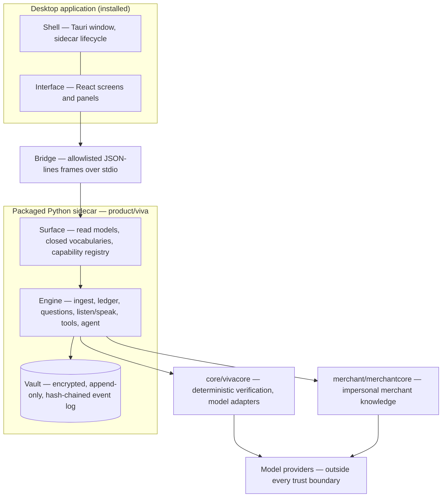

# Architecture Overview — the map of the machine

**State:** built
**Rules:** none

This is the orientation map: what OrionViva is made of, what each piece is
for, and which document holds each piece's argument. It is a map and never an
authority — every claim here is a pointer, and where this document and a
component's own document disagree, the component's document wins. It exists
because the design-doc set plus [reading-guide.md](reading-guide.md) is the
buildable record, and a person arriving fresh still needs one page that says
where everything sits before choosing which record to open. Its companion is
[data-flow.md](data-flow.md), which walks the same machine in motion.

## The shape in one paragraph

OrionViva is an installed desktop application over a local, encrypted,
append-only event log — the vault. Documents go in; deterministic verification
decides what is true; events record it; every view is a projection replayed
from the log; and one contracted surface carries read models across a small
typed bridge to the interface a person sees. Models read documents and parse
intent, but no model ever certifies a figure, computes one, or writes one into
a sentence — trust is constructed by verification and carried as a grade on
every number, end to end.

## The package trees

**`core/vivacore` — the trust core.** One copy of the code that decides
whether a number can be trusted: deterministic verification (locale-aware
normalization, exact decimal arithmetic that refuses floats, matching), the
typed claim schema extraction is parsed into, provider-agnostic and
version-pinned model adapters, and the shared versioned extraction prompt. It
is domain-agnostic — it knows documents, claims and verification, never the
product's ledger or a benchmark. The adapters are hand-written HTTP by design;
the argument is in
[threat-model-and-ingestion-security.md](threat-model-and-ingestion-security.md).

**`merchant/merchantcore` — the merchant knowledge base.** A peer to vivacore
holding only impersonal, reusable merchant knowledge: deterministic descriptor
normalization, the multi-attribute MerchantRecord, a batched model enrichment
engine, and the merchant-to-category commons. The personal ledger never
crosses this boundary; the product submits impersonal hints and syncs results
back as events. The argument is in
[merchantcore-package.md](merchantcore-package.md) and
[merchant-catalog-and-commons.md](merchant-catalog-and-commons.md).

**`bench/vivabench` — the admission exam.** The permanent benchmark harness
that grades candidate models on a frozen corpus across input modes before any
model is trusted with a role, publishing no composite leaderboard. It consumes
vivacore's adapters and verification rather than carrying its own. The
argument is in [benchmark-harness-design.md](benchmark-harness-design.md) and
[benchmark-harness-architecture.md](benchmark-harness-architecture.md).

**`product/viva` — the product.** Everything personal lives here, in tiers
whose import direction is enforced by tests (the boundary rule is in
[user-interface-architecture-and-delivery.md](user-interface-architecture-and-delivery.md)):

- `viva/ledger` — the encrypted, hash-chained, append-only event store; the
  event vocabulary; double-entry postings; and the projections (balances, net
  worth, streams, merchants, statements) replayed from it.
- `viva/ingest` — the document pipeline: raw capture, classify, the document
  type registry, extraction, reconciliation diagnosis, review, merchants,
  transfers, categorization.
- `viva/questions.py` and `viva/engine.py` — the outbound and inbound halves
  of the learning loop: the ranked question queue, and the single door through
  which a person's reply becomes a recorded ruling.
- `viva/listen.py`, `viva/reply.py`, `viva/speak.py`, `viva/render.py`,
  `viva/persona` — Viva's two directions: a sentence becoming double-entry,
  and intents becoming sentences through versioned phrasing packs.
- `viva/tools` — the read-tool registry over the projections, the shape
  mechanism, and the modality-neutral runner that answers a person's question
  with citations.
- `viva/agent` — the maintenance agent's observe → plan → perform → record
  loop and its budget.
- `viva/surface` — the contract with the interface: read models, closed
  vocabularies, the capability registry and the operation table.
- `viva/desktop_bridge` — the transport that serves those operations to the
  shell over JSON-lines.
- `viva/honesty.py`, `viva/eval_listen.py`, `viva/evals`, plus the rebuild,
  reingest and reset instruments — the measurement layer.

**`desktop/` — the shell and the interface.** A Tauri shell hosting a React
interface. The interface renders figures, grades, coverage, caveats and
citations, and computes no financial fact. The words for these layers are
fixed in [the-words-the-interface-uses.md](the-words-the-interface-uses.md);
the architecture and its rules are in
[user-interface-architecture-and-delivery.md](user-interface-architecture-and-delivery.md);
what is actually live is measured in
[user-interface-implementation-status.md](user-interface-implementation-status.md).

## The layers of the desktop application

Five words name five layers, and the dependency direction between them is
one-way, held by gates in both languages: the **desktop application** is the
whole installed thing; the **shell** is the native host; the **interface** is
what a person looks at and touches; the **surface** is the contract; the
**bridge** is transport that carries frames and understands none of them. The
interface depends on the surface contract, never on event bodies; the engine
and ledger never import the surface, the bridge or frontend code.

## The trust boundaries

The boundaries are the architecture; the components above are arranged around
them.

**The vault.** Every fact is an event, sealed with authenticated encryption
and chained by record hash, so history is never rewritten and tampering is
visible — and the chain verifies without the key, so integrity is checkable by
someone who cannot read the contents. State is always a projection. The
argument is in [local-first-storage-and-crypto.md](local-first-storage-and-crypto.md)
and the decisions in
[decisions/ADR-004-append-only-log-and-anchoring.md](decisions/ADR-004-append-only-log-and-anchoring.md)
and [decisions/ADR-005-encryption-from-commit-one.md](decisions/ADR-005-encryption-from-commit-one.md).

**Models propose; verification decides.** A model's reading of a document is a
proposal that deterministic verification checks against the document's own
identity, and a model never certifies a figure
([extraction-and-confidence.md](extraction-and-confidence.md),
[model-trust-policy.md](model-trust-policy.md),
[decisions/ADR-010-verification-never-in-weights.md](decisions/ADR-010-verification-never-in-weights.md)).
On the answering side the same stance is structural: a model commits a shape
with typed holes before any data exists, code binds the holes to ledger
references, and one renderer writes the sentence, so a model writes no digits
into an answer
([projection-decomposition-and-the-tool-registry.md](projection-decomposition-and-the-tool-registry.md)).

**The privacy boundary.** Raw descriptors and everything personal stay inside
the vault. Only impersonal, linted hints cross to merchantcore, and only a
commercial catalog comes back
([merchant-catalog-and-commons.md](merchant-catalog-and-commons.md)).

**Zero exfiltration, and outbound is recorded.** Nothing leaves the machine
except the model calls the person configured, and every outbound exchange is
recorded with its model id and prompt version
([decisions/ADR-006-zero-exfiltration.md](decisions/ADR-006-zero-exfiltration.md),
[decisions/ADR-003-raw-capture-doctrine.md](decisions/ADR-003-raw-capture-doctrine.md)).

**The interface computes nothing.** Figures cross the bridge as exact decimal
strings carrying grade, provenance, as-of date, coverage and caveats, and the
interface renders them without financial arithmetic
([user-interface-architecture-and-delivery.md](user-interface-architecture-and-delivery.md)).

## Where the open seams are

Capabilities that do not exist yet attach at seams the built system already
has. Each needs its own design decision before it becomes real; the register
of record is [backend-capability-gaps.md](backend-capability-gaps.md), with
the direction documents named beside each seam here.

- **Account aggregation** would be a new acquisition path feeding the same
  raw-capture front door
  ([account-connection-research.md](account-connection-research.md)).
- **External anchoring and issuer signatures** would add outside witnesses to
  the chain head that already exists
  ([own-chain-vs-borrowed-trust.md](own-chain-vs-borrowed-trust.md)).
- **Audio voice** would be a new modality on the same cited conversation turn,
  never a second answer path
  ([viva-listens-and-speaks.md](viva-listens-and-speaks.md)).
- **Current-period control** can compose the built grounded obligations and
  quiet findings with liquid balances and stated plans without adding a
  notification path or Viva initiation
  ([the-maintenance-agent.md](the-maintenance-agent.md),
  [the-suggestions-channel.md](the-suggestions-channel.md)).
- **Household scope and sync** would move the same encrypted vault through a
  blind relay
  ([multi-device-and-remote-access.md](multi-device-and-remote-access.md)).

## Why

A summary of a claim is a second copy of that claim, and two copies drift — so
this document restates no rule, no count, and no figure. What it holds is the
one thing no single component document can: where each component sits relative
to the others, and which document to open next. The documentation gates that
hold the rest of this folder hold it too: its links must resolve, it names no
date, and it is slotted into the reading guide.

## Open

- When a package tree, a layer, or a trust boundary is added or removed, this
  map is wrong until amended in the same cycle, per the standing rule that a
  cycle corrects every claim it makes false.
- The open-seams list mirrors the absent capabilities in
  [backend-capability-gaps.md](backend-capability-gaps.md); when a seam closes
  there, its entry here moves into the built description.
