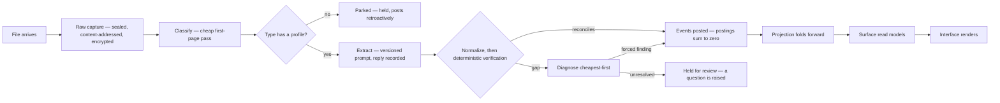
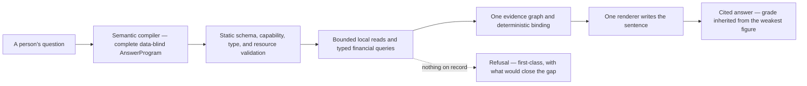

# Data Flow — the journeys through the machine

**State:** built
**Rules:** none

[architecture-overview.md](architecture-overview.md) is the machine at rest;
this is the machine in motion. Each section walks one journey a piece of data
actually takes, in order, naming the module that carries each step and the
document that argues for it. Like the overview, it is a map and never an
authority: where a step's own document or the code disagrees with a sentence
here, they win.

## A document becomes numbers

The ingest pipeline (`product/viva/ingest/pipeline.py`) carries every file
that arrives, whatever the path it arrived by:

1. **Raw capture, first.** The original bytes are sealed, content-addressed
   and encrypted before anything parses them, so a re-upload is a no-op and
   judgment never precedes evidence
   ([decisions/ADR-003-raw-capture-doctrine.md](decisions/ADR-003-raw-capture-doctrine.md)).
2. **Classify.** A cheap pass over the first page decides the document type;
   the type resolves through the registry to a format profile
   ([doc-type-registry-and-format-profiles.md](doc-type-registry-and-format-profiles.md)).
   A type with no extraction profile is **parked** — held and acknowledged,
   never discarded — and posts retroactively once a profile exists, with no
   re-upload.
3. **Extract.** A model reads the document under a versioned prompt loaded
   from a file ([prompts-as-files.md](prompts-as-files.md)), and the reply is
   recorded verbatim with its model id and prompt version. The read is a
   proposal; nothing downstream trusts it on its own.
4. **Normalize and verify.** Locale-aware normalization, then deterministic
   verification: exact decimal arithmetic against the document family's own
   identity — a statement's balances and movements must reconcile, a pay
   stub's gross minus deductions must equal net
   ([extraction-and-confidence.md](extraction-and-confidence.md)). A genuinely
   ambiguous figure is refused, never guessed.
5. **Diagnose, cheapest first.** When a document does not reconcile, the gap
   is diagnosed by a ladder — deterministic diagnosis, then a bounded re-read,
   then a human asked well — and only a forced finding is applied and
   re-checked; anything else holds the statement for review rather than
   posting a guess
   ([verification-findings-and-correction.md](verification-findings-and-correction.md)).
6. **Post.** Verified claims become events in the vault: a movement's postings
   sum to exactly zero, the counter-leg goes to an uncategorized bucket graded
   unverified, and every later categorization is a read-side overlay — the
   posted leg is never rewritten
   ([from-your-words-to-the-ledger.md](from-your-words-to-the-ledger.md)).
   Ingestion is any-order with bidirectional heal: an older statement prepends
   and re-seats the opening balance, and every ordering of the same documents
   yields an identical chain
   ([individual-as-enterprise.md](individual-as-enterprise.md)).
7. **Project.** One cached incremental projection folds forward on each
   append, so ordinary reads never re-decrypt the log; the surface reads the
   projection, and the interface renders what the surface says.

## Viva asks, a person answers, a ruling is recorded

The learning loop is one primitive appearing everywhere: gather signals, grade
the match, ask only when genuinely ambiguous, record the ruling, apply it on
the read side.

- **The queue.** Everything Viva needs to know surfaces through one ranked
  question queue (`product/viva/questions.py`) — a read-side projection ranked
  by consequence and scoped to the most general unit that is still honest.
  Question text is a deterministic template, because a model that phrased a
  question could smuggle a claim into it
  ([the-question-queue.md](the-question-queue.md)).
- **The answer.** A person's reply enters through one door
  (`product/viva/engine.py`), checked against the slot types the question
  declared. Where the answer is a sentence, the listen path
  (`product/viva/listen.py`) turns it into double-entry through steps of which
  exactly one is a model call — and that call parses *intent* only: a ruling's
  legs structurally cannot carry a figure, and no account comes into being
  without an explicit yes
  ([from-your-words-to-the-ledger.md](from-your-words-to-the-ledger.md),
  [viva-listens-and-speaks.md](viva-listens-and-speaks.md)).
- **The confirmation.** Where an answer returns a Proposal, the opened-vault
  bridge retains its unapplied structure and gives the interface an opaque
  identity plus the summary a person inspects. A yes or no crosses through the
  same typed confirmation slot; the client never sends proposal legs back.
- **The ruling.** A correction is an event, applied as a graded overlay on the
  read side; nothing posted is rewritten. A decline snapshots the stake, so a
  declined question stays quiet until the evidence changes — no timers
  ([honest-aggregates-and-the-learning-loop.md](honest-aggregates-and-the-learning-loop.md)).

## A person asks, and the answer arrives with receipts

The answering path (`product/viva/answer_program/`, `product/viva/query/`, and
the delivery laws in `product/viva/tools/`) is built so that a model compiles
meaning and never sees or produces a current-turn financial value:

1. **The program.** One model call commits the typed shape, finite local read
   graph, selectors, and required/optional policy before any read. One targeted
   structural repair is the only second attempt.
2. **Validation and execution.** Code validates the whole graph against the
   capability manifest and resource policy, then executes admitted tool reads
   and typed Financial Query IR operators under a running deadline.
3. **Evidence and binding.** Results enter one evidence graph with trusted
   quantity, currency, boundary, grade, and record provenance. Code binds holes
   to compatible references in that graph, and one renderer writes the sentence.
   Nothing inspects the finished sentence, because a model writes no digits into
   one.
4. **The record.** Every exchange is kept verbatim with the prompt version and
   model that produced it, which is what makes the honesty measurement
   ([eval-harness-design.md](eval-harness-design.md)) possible at all. Each
   turn re-fetches every figure; an answer is never composed from what an
   earlier answer said.

## A merchant becomes a category

Categorization belongs to the merchant, not the transaction. Merchant
resolution runs over the whole vault at once, because the boundary between a
sender name and the noise around it is a property of the corpus rather than of
any line. Impersonal hints cross to merchantcore, which makes its own batched
model call over new merchants only and returns a catalog; the product syncs
results back as events and applies them retrospectively on the read side. Raw
descriptors never cross, and what has no stable merchant identity — a peer
payment — takes the strictly local path instead
([merchant-catalog-and-commons.md](merchant-catalog-and-commons.md),
[local-categorization-and-custom-categories.md](local-categorization-and-custom-categories.md)).

## What crosses the bridge

The shell starts the packaged sidecar, and everything between the interface
and the vault travels as allowlisted, typed JSON-lines frames over standard
input and output — no localhost server. The handshake is versioned; the
operation table (`product/viva/surface/operations.py`) declares every
operation the sidecar serves; the capability registry
(`product/viva/surface/capabilities.py`) declares what each capability may do,
and the interface derives its navigation from it. A figure crosses as an exact
decimal string carrying identity, measure, as-of date, coverage, grade,
provenance and caveats — a float fails construction — and every panel declares
one state from a closed vocabulary, so progressive disclosure is a contract
rather than a pile of frontend conditionals
([user-interface-architecture-and-delivery.md](user-interface-architecture-and-delivery.md)).
Document actions additionally cross with separate terminal, ingest and reading
states, so a captured file is not presented as one that posted. A proposal
crosses with an opaque identity and inspectable summary while its structure
remains in the opened-vault bridge.

## What runs when nobody asked

The maintenance agent (`product/viva/agent/`) runs an observe → plan → perform
→ record loop under a budget denominated in model calls, recording what it did
as events; its verbs come from a registry that grows with verbs, never with
accounts ([the-maintenance-agent.md](the-maintenance-agent.md),
[agent-toolset.md](agent-toolset.md)). Long-running work reports itself on the
progress channel, whose events go to subscribers and are never appended to the
event log ([jobs-and-the-progress-channel.md](jobs-and-the-progress-channel.md)).

## The instruments beside the product

The measurement layer exercises the same journeys rather than adding new
ones. **Rebuild** replays stored claims through today's parsers into a new
vault at no model cost; **reingest** re-reads the stored originals through
today's prompts at real cost and reports regressions; **reset** rebuilds the
log with categorization dropped and the person's own rulings preserved. The
honesty harness measures what answers a person actually got; the admission
exam in `bench/` grades candidate models on a frozen corpus before any model
earns a role ([eval-harness-design.md](eval-harness-design.md),
[benchmark-harness-design.md](benchmark-harness-design.md)).

## Why

The component documents each hold one argument deeply, and none of them shows
a datum travelling end to end — which is the first thing a newcomer needs and
the last thing any single component can provide. This document holds the
journeys and nothing else: no rule, no count, no figure, so there is nothing
here to drift except the order of the steps, and a cycle that changes an order
corrects this document in the same cycle.

## Open

- The journeys here are the built ones. The seams where new journeys would
  attach — aggregation, anchoring, audio, sync — are mapped in
  [architecture-overview.md](architecture-overview.md) and registered in
  [backend-capability-gaps.md](backend-capability-gaps.md).
- Module paths named here are anchors a reader can open; when a module moves,
  this document is wrong until amended in the same cycle.
